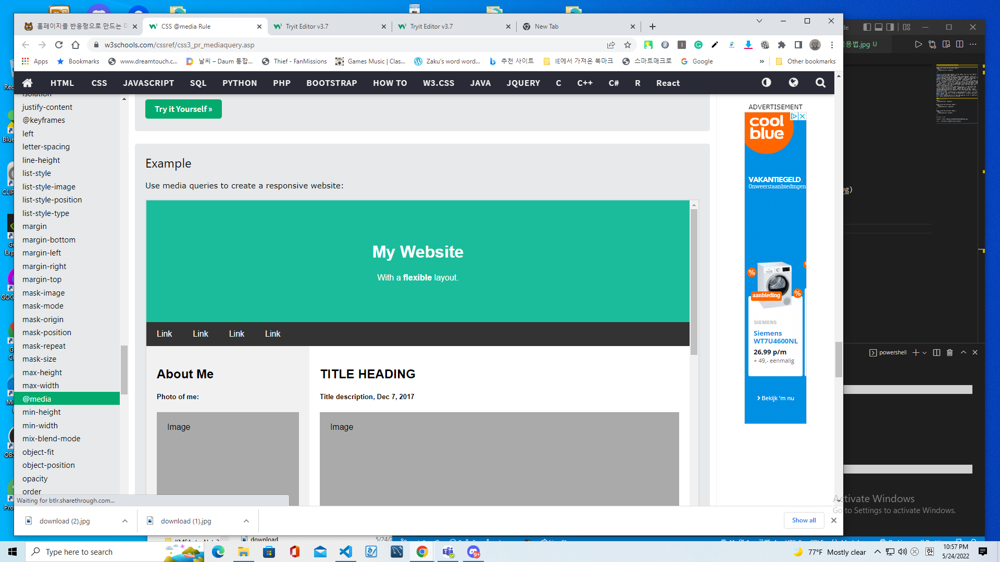
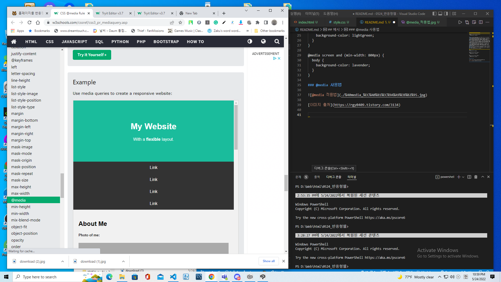

### 반응형 웹에 사용되는 미디어쿼리 작성법

```
@media only screen and (max-width: 600px) {
  body {
    background-color: lightblue;
  }
}
```

| **@media** | 미디어 쿼리가 시작됨을 선언한다. @media, only, all, and, (조건문) 사이에 포함되어 있는 공백은 필수적이다. |
| ------------ | ------------- |
|**only** | only 키워드는 미디어 쿼리를 지원하는 사용자 에이전트만 미디어 쿼리 구문을 해석하라는 명령이며 생략 가능하다. 생략했을 때 기본 값은 only로 처리 된다. 생략해도 무방하므로 이 키워드는 일반적으로 작성하지 않는다. 이 자리에는 not 키워드를 사용할 수 있는데 뒤에 오는 모든 조건을 부정하는 연산을 한다. |
| **all** | all 키워드는 미디어 쿼리를 해석해야 할 대상 미디어를 선언한 것이다. all 이면 모든 미디어가 이 구문을 해석해야 한다. all 키워드 대신 screen 또는 print와 같은 특정 미디어를 구체적으로 언급할 수도 있다. all 키워드는 생략 가능하고 생략했을 때 기본 값은 all 으로 처리된다. 이 밖에도 다양한 미디어 타입(all, aural, braille, embossed, handheld, print, projection, screen, speech, tty, tv)이 있다. all, screen, print를 가장 널리 쓴다. |
| **and** | and 키워드는 논리적으로 ‘AND’ 연산을 수행하여 앞과 뒤의 조건을 모두 만족해야 한다는 것을 의미한다. 조건이 유일하거나 또는 only, all과 같은 선행 키워드가 생략되면 and 키워드는 사용하지 말아야 한다. and 대신 콤마 , 기호를 사용하면 ‘OR’ 연산을 수행한다. ‘OR’ 연산은 나열된 조건 중에서 하나만 참이어도 {실행문}을 해석한다. |
| **(조건문)** | 브라우저는 조건문이 참일때{실행문}을 처리하고 거짓일 때 무시한다. 조건문은 두 가지 이상 등장할 수 있다. 둘 이상의 조건문은 and 키워드 또는 콤마 , 기호로 연결해야 한다. |
| **{실행문}** | 일반적인 CSS 코드를 이 괄호 안에 작성한다. 브라우저는 (조건문)이 참일때 실행문 안쪽에 있는 CSS 코드를 해석한다. |

예시
-------------------
```
body {
  background-color: lightblue;
}

@media screen and (min-width: 400px) {
  body {
    background-color: lightgreen;
  }
}

@media screen and (min-width: 800px) {
  body {
    background-color: lavender;
  }
}
```

### @media 사용법


[이미지 출처](https://rgy0409.tistory.com/3134)

### W3에서 발췌한 반응형 웹의 예시







https://www.w3schools.com/cssref/tryit.asp?filename=trycss3_media3
```
@media (max-width: 700px) {
  .row, .navbar {   
    flex-direction: column;
```
### Media Types
아래의 코드들은 @media에 코드를 작성할 때 사용되는 코드들이다.

| Value | Description |
| ------------ | ------------- |
| all | Default. Used for all media type devices  |
| print | Used for printers  |
| screen | Used for computer screens, tablets, smart-phones etc. |
| speech | Used for screenreaders that "reads" the page out loud |

### Media Features

| **Value** |  Description |
| ------------ | ------------- |
| **any-pointer**	| Is any available input mechanism a pointing device, and if so, how accurate is it? (added in Media Queries Level 4) |
| **aspect-ratio** | The ratio between the width and the height of the viewport |
| **color** | The number of bits per color component for the output device |
| **color-gamut** | The approximate range of colors that are supported by the user agent and output device (added in Media Queries Level 4) |
| **color-index** | The number of colors the device can display |
| **grid** | Whether the device is a grid or bitmap |
| **height** | The viewport height |
| **hover** | Does the primary input mechanism allow the user to hover over elements? (added in Media Queries Level 4) |
| **inverted-colors**	| Is the browser or underlying OS inverting colors? (added in Media Queries Level 4) |
| **light-level** | Current ambient light level (added in Media Queries Level 4) |
| **max-aspect-ratio** | The maximum ratio between the width and the height of the display area |
| **max-color** | The maximum number of bits per color component for the output device |
| **max-color-index** |	The maximum number of colors the device can display |
| **max-height** | The maximum height of the display area, such as a browser window |
| **max-monochrome** | The maximum number of bits per "color" on a monochrome (greyscale) device |
| **max-resolution** | The maximum resolution of the device, using dpi or dpcm |
| **max-width** | The maximum width of the display area, such as a browser window |
| **min-aspect-ratio** | The minimum ratio between the width and the height of the display area |
| **min-color** | The minimum number of bits per color component for the output device |
| **min-color-index** | The minimum number of colors the device can display |
| **min-height** | The minimum height of the display area, such as a browser window |
| **min-monochrome** | The minimum number of bits per "color" on a monochrome (greyscale) device |
| **min-resolution** | The minimum resolution of the device, using dpi or dpcm |
| **min-width** | The minimum width of the display area, such as a browser window |
| **monochrome** | The number of bits per "color" on a monochrome (greyscale) device |
| **orientation** | The orientation of the viewport (landscape or portrait mode) |
| **overflow-block** | How does the output device handle content that overflows the viewport along the block axis (added in Media Queries Level 4) |
| **overflow-inline** | Can content that overflows the viewport along the inline axis be scrolled (added in Media Queries Level 4) |
| **pointer** | Is the primary input mechanism a pointing device, and if so, how accurate is it? (added in Media Queries Level 4) |
| **resolution** | The resolution of the output device, using dpi or dpcm |
| **scan** | The scanning process of the output device |
| **scripting** | Is scripting (e.g. JavaScript) available? (added in Media Queries Level 4) |
| **update** | How quickly can the output device modify the appearance of the content (added in Media Queries Level 4) |
|**width** | The viewport width |

[출처](https://www.w3schools.com/cssref/css3_pr_mediaquery.asp)